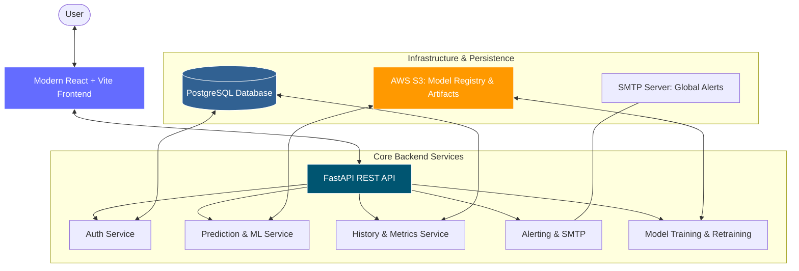

# 🧬 BioNexus: Advanced Bioprocess Analytics Platform

[](https://fastapi.tiangolo.com/)
[](https://reactjs.org/)
[](https://vitejs.dev/)
[](https://aws.amazon.com/)
[](https://www.postgresql.org/)

BioNexus is a premium, end-to-end bioprocess monitoring and machine learning platform. Originally a Streamlit dashboard, it has been modernized into a full-scale enterprise application featuring a **React + Vite** frontend and a robust **FastAPI** backend designed for cloud scalability on **AWS**.

---

## 🏗 End-to-End Architecture



---

## ✨ Key Features

-   🚀 **Modern Dashboard**: Frosted glassmorphism UI built with React and Vite for real-time bioprocess monitoring.
-   🧠 **ML-Powered Predictions**: Predict bioreactor outcomes using high-performance models (Joblib/Scikit-learn) stored in AWS S3.
-   📊 **Historical Analysis**: Full metric persistence with interactive charting and historical data exploration.
-   🔔 **Intelligent Alerting**: Threshold-based automated alerts sent via SMTP when bioprocess parameters deviate from norms.
-   🔒 **Secure Auth**: JWT-based authentication with role-based access control (Admin/User).
-   🏥 **Health Monitoring**: Real-time system health checks including CPU, RAM, and DB latency.

---

## 🛠 Tech Stack

-   **Frontend**: React.js, Vite, Tailwind CSS (optional), Chart.js/Recharts.
-   **Backend**: FastAPI (Python 3.10+), SQLAlchemy (ORM).
-   **Database**: PostgreSQL (Support for RDS, Neon, or local).
-   **Storage**: AWS S3 (Models, Metadata, and Artifacts).
-   **Deployment**: Docker, Render, AWS App Runner / ECS.

---

## 🚦 Getting Started

### 1. Prerequisites
-   Python 3.10+
-   Node.js (for frontend)
-   AWS Access for S3 bucket
-   PostgreSQL instance

### 2. Backend Setup
```bash
# Clone & Navigate
git clone <repo-url>
cd bionexus-backend-aws

# Install dependencies
pip install -r requirements.txt

# Create .env (see Environment Variables section)
# Start the API
uvicorn app.main:app --reload
```

### 3. Frontend Setup
```bash
cd app/react-frontend
npm install
npm run dev
```
The React frontend will be available at `http://localhost:5173`.

---

## 🔑 Environment Variables

Create a `.env` file in the root directory:

| Variable | Description |
| :--- | :--- |
| `DATABASE_URL` | PostgreSQL connection string (Neon/RDS/Local). |
| `AWS_ACCESS_KEY_ID` | Your AWS access key. |
| `AWS_SECRET_ACCESS_KEY` | Your AWS secret key. |
| `AWS_REGION` | AWS region (e.g., `us-east-1`). |
| `S3_BUCKET` | S3 bucket for model assets. |
| `MODEL_KEY` | Path to the `.joblib` model file in S3. |
| `SMTP_SERVER` | SMTP host for email alerts. |
| `SMTP_USER` | SMTP username. |
| `SMTP_PASSWORD` | SMTP password. |

---

## ☁️ AWS Deployment

-   **Database**: Amazon RDS (PostgreSQL).
-   **Hosting**: AWS App Runner or ECS (Fargate) for the Dockerized backend.
-   **Secrets**: AWS Secrets Manager for environment variables.
-   **Static Assets**: React build can be served via CloudFront + S3 or standard FastAPI static mount.

---

## 📜 License
This project is licensed under the MIT License - see the LICENSE file for details.

